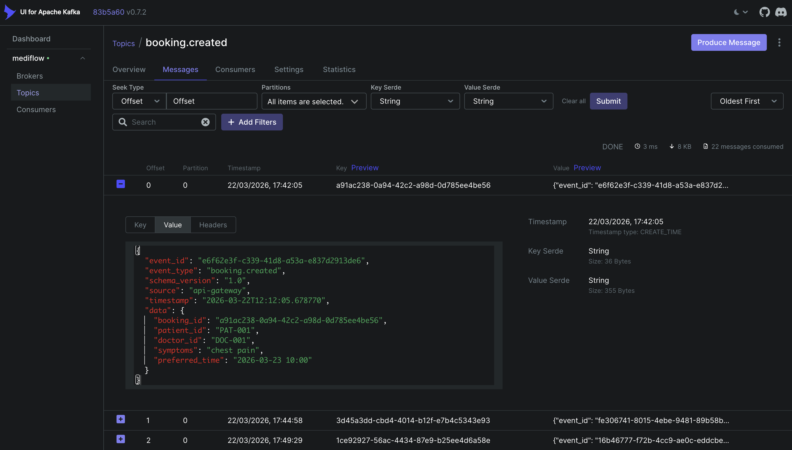
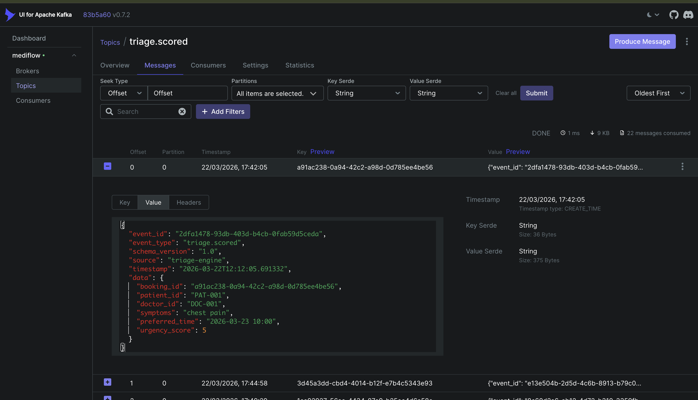
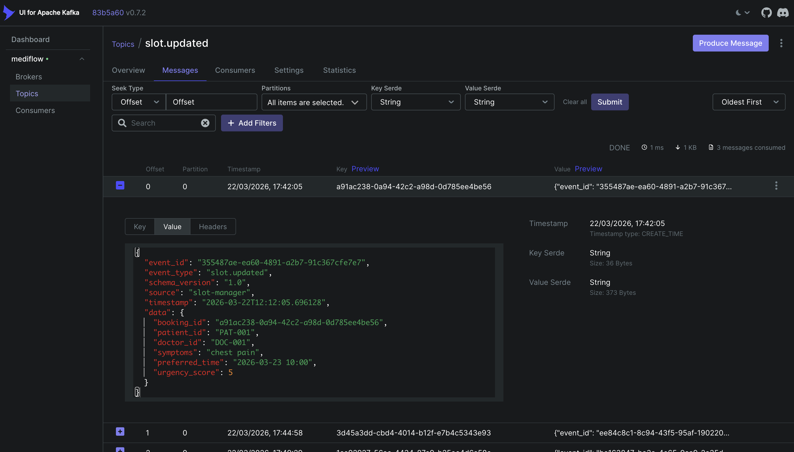
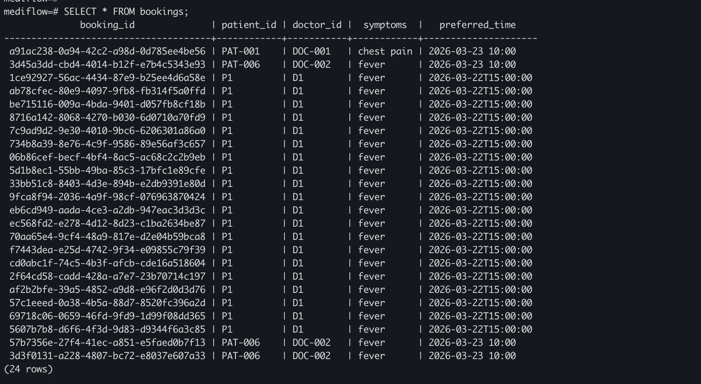
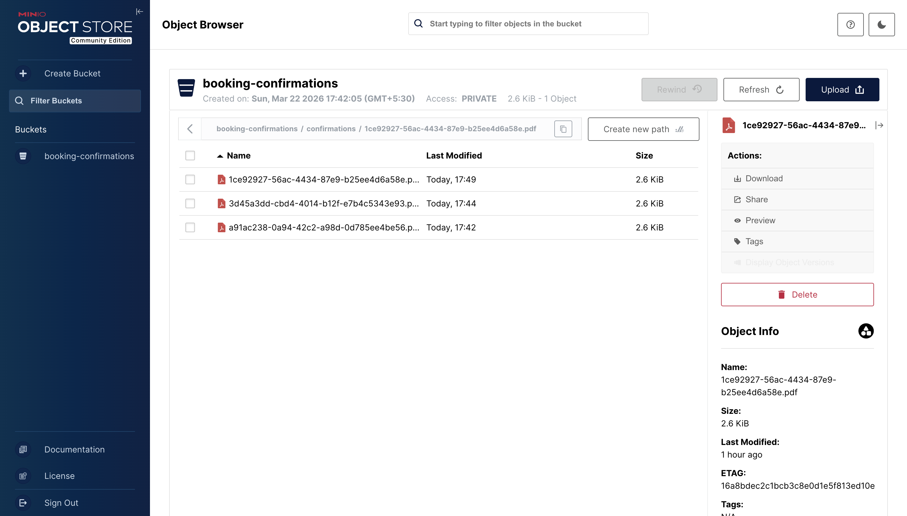
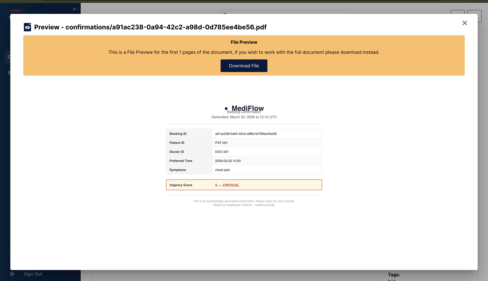
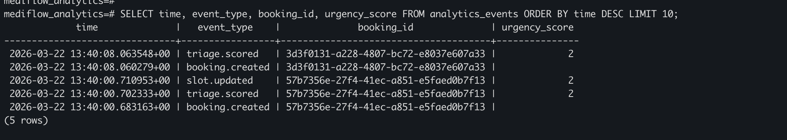
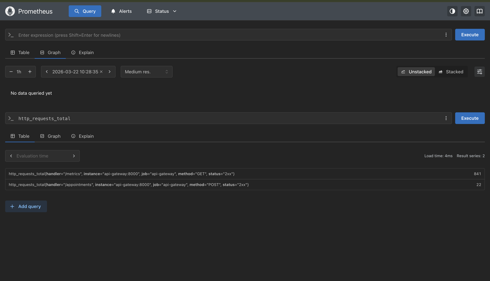
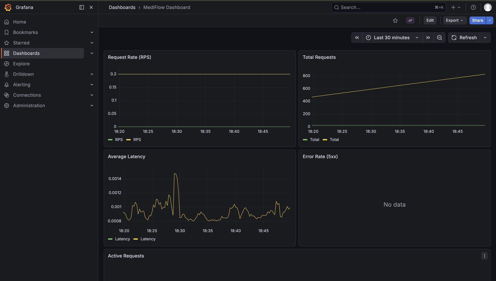

# 🏥 MediFlow — Real-Time Healthcare Appointment & Triage Platform

> A **production-grade, event-driven microservices system** simulating how modern healthcare platforms handle appointment booking, AI-powered triage prioritization, distributed slot management, PDF confirmation generation, real-time notifications, and time-series analytics — all powered by Apache Kafka.

[](https://python.org)
[](https://fastapi.tiangolo.com)
[](https://kafka.apache.org)
[](https://docker.com)
[](LICENSE)

---

## 📌 Table of Contents

- [Overview](#-overview)
- [Architecture](#-architecture)
- [Tech Stack](#️-tech-stack)
- [Key Features](#-key-features)
- [Project Structure](#-project-structure)
- [Getting Started](#-getting-started)
- [Services & Ports](#-services--ports)
- [Event Flow](#-event-flow)
- [API Reference](#-api-reference)
- [Analytics](#-analytics)
- [Monitoring](#-monitoring)
- [Future Improvements](#-future-improvements)

---

## 🔍 Overview

MediFlow simulates a real-world healthcare appointment platform where:

- 🧑‍⚕️ Patients book appointments via a REST API
- ⚡ Events flow asynchronously through **Apache Kafka**
- 🧠 A **triage engine** scores patient urgency in real time
- 🔒 A **slot manager** prevents double-booking using **Redis distributed locks**
- 📄 A **PDF confirmation** is generated and stored in **MinIO** object storage
- 📩 A **notification service** sends confirmations with a download link asynchronously
- 📊 An **analytics service** stores every event in **TimescaleDB** for time-series queries

Each service is fully decoupled, independently deployable, and communicates only through Kafka events — no direct service-to-service calls.

---

## 🏛 Architecture



### Kafka Topic Map

| Topic | Producer | Consumer(s) | Purpose |
|-------|----------|-------------|---------|
| `booking.created` | API Gateway | Booking Service, Triage Engine, Analytics | New appointment request |
| `triage.request` | Booking Service | Triage Engine | Request urgency scoring |
| `triage.scored` | Triage Engine | Slot Manager, Analytics | Urgency result |
| `slot.updated` | Slot Manager | Notification Service, Analytics | Slot confirmed |
| `notify.send` | Slot Manager | Notification Service | Trigger notification |
| `analytics.events` | All services | Analytics Service | Metrics pipeline |

---

## ⚙️ Tech Stack

| Layer | Technology | Purpose |
|-------|-----------|---------|
| **API** | FastAPI + Uvicorn | REST API gateway |
| **Messaging** | Apache Kafka + Zookeeper | Async event bus |
| **Database** | PostgreSQL 15 | Booking persistence |
| **Time-Series DB** | TimescaleDB (pg15) | Analytics & metrics |
| **Cache / Locking** | Redis 7 | Distributed slot locks |
| **Object Storage** | MinIO (S3-compatible) | PDF confirmations |
| **PDF Generation** | ReportLab | Booking confirmation docs |
| **Monitoring** | Prometheus + Grafana | Metrics & dashboards |
| **Kafka UI** | Provectus Kafka UI | Topic & consumer monitoring |
| **Containerization** | Docker + Docker Compose | Full-stack orchestration |
| **Language** | Python 3.11 | All services |

---

## 🔥 Key Features

### ⚡ Event-Driven Architecture
- Fully async, Kafka-based communication — zero direct HTTP calls between services
- Services can crash and restart without data loss — Kafka offsets preserve state
- Health checks on every infra container ensure services start only when dependencies are truly ready

### 🧠 Triage Engine
- Scores patient urgency from symptoms in real time
- Keyword-based scoring model, extensible to an ML classifier:
  - `chest pain` → urgency **5** (critical)
  - `breathing` → urgency **4** (high)
  - `fever` → urgency **2** (low)
  - default → urgency **1** (routine)

### 🔒 Distributed Slot Locking
- Redis `SET NX EX` pattern atomically prevents race conditions
- Exactly one booking per `doctor_id + time_slot` — guaranteed
- 30-second TTL prevents permanent deadlocks if a service crashes mid-flow

### 📄 PDF Confirmation + MinIO Storage
- ReportLab generates a formatted A4 PDF per confirmed booking
- Includes patient details, doctor, time, and a color-coded urgency badge
- Uploaded to MinIO under `confirmations/<booking_id>.pdf`
- Presigned download URL (7-day validity) attached to every notification

### 📩 Async Notification System
- Consumes `slot.updated` → generates PDF → uploads to MinIO → logs confirmation
- Fully decoupled — swap print statements for real SendGrid/Twilio in one file

### 📊 Time-Series Analytics
- Analytics service consumes all Kafka topics simultaneously
- Inserts every event into a **TimescaleDB hypertable** — automatically chunked by time
- Query bookings per hour, urgency trends, end-to-end pipeline latency, critical patient alerts

### 🔭 Observability Stack
- **Prometheus** scrapes metrics from all services
- **Grafana** dashboards for request rate, P99 latency, consumer lag
- **Kafka UI** shows live topic offsets, consumer groups, and message payloads

---

## 📁 Project Structure

```
mediflow/
│
├── services/
│   ├── api-gateway/               # FastAPI REST API
│   │   ├── app/
│   │   │   ├── main.py
│   │   │   ├── routes.py
│   │   │   ├── models.py
│   │   │   ├── producer.py
│   │   │   └── config.py
│   │   ├── Dockerfile
│   │   └── requirements.txt
│   │
│   ├── booking_service/           # Persists bookings to PostgreSQL
│   │   ├── app/
│   │   │   ├── main.py
│   │   │   ├── consumer.py
│   │   │   ├── models.py
│   │   │   ├── db.py
│   │   │   └── config.py
│   │   └── Dockerfile
│   │
│   ├── triage_engine/             # Scores patient urgency (1–5)
│   │   ├── app/
│   │   │   ├── main.py
│   │   │   ├── consumer.py
│   │   │   ├── producer.py
│   │   │   ├── scoring.py
│   │   │   └── config.py
│   │   └── Dockerfile
│   │
│   ├── slot_manager/              # Redis distributed locking
│   │   ├── app/
│   │   │   ├── main.py
│   │   │   ├── consumer.py
│   │   │   ├── producer.py
│   │   │   ├── redis_lock.py
│   │   │   └── config.py
│   │   └── Dockerfile
│   │
│   ├── notification_service/      # PDF → MinIO → notification
│   │   ├── app/
│   │   │   ├── main.py
│   │   │   ├── consumer.py
│   │   │   ├── pdf_generator.py
│   │   │   ├── minio_client.py
│   │   │   └── config.py
│   │   └── Dockerfile
│   │
│   └── analytics_service/         # Time-series analytics → TimescaleDB
│       ├── app/
│       │   ├── main.py
│       │   ├── consumer.py
│       │   ├── db.py
│       │   └── config.py
│       ├── queries.sql
│       └── Dockerfile
│
├── libs/
│   └── kafka_client/              # Shared Kafka producer + event schema
│       ├── producer.py
│       ├── schemas.py
│       └── __init__.py
│
├── monitoring/
│   ├── prometheus.yml
│   └── grafana/
│       ├── dashboards/ 
│       │   └── mediflow-dashboard.json
│       └── provisioning/
│           ├── dashboards/
│           │   └── dashboard.yml
│           └── datasources/
│               └── datasource.yml
│       
│
├── docs/
│   ├── architecture.svg
│   ├── booking_created_kafka.png
│   ├── triage_score_kafka.png
│   ├── slot_update_kafka.png
│   ├── postgresql_db.png
│   ├── minio.png
│   ├── minio_preview.png
│   ├── timescaledb.png
│   ├── Prometheus.png
│   └── grafana.png
│ 
│ 
├── scripts/
│   └── test_kafka.py
│   
│ 
│ 
├── docker-compose.yml
└── README.md
```

---

## 🚀 Getting Started

### Prerequisites

- [Docker](https://www.docker.com/) & Docker Compose v2+
- 6GB+ RAM recommended (Kafka + TimescaleDB + all services)

### Run the System

```bash
# Clone the repository
git clone https://github.com/ESHWAR-333/mediflow.git
cd mediflow

# Start all services
docker compose up --build
```

Services start in strict dependency order:

```
Zookeeper → Kafka → Postgres / Redis / MinIO / TimescaleDB → Application services
```

Health checks on every infrastructure container ensure nothing starts until its dependency is genuinely ready — not just "container running" but "port accepting connections".

### Verify Everything is Running

```bash
docker ps
```

All containers should show `Up` or `Up (healthy)`.

---

## 🌐 Services & Ports

| Service | URL | Credentials | Description |
|---------|-----|-------------|-------------|
| **API Gateway** | http://localhost:8000 | — | REST API |
| **API Docs** | http://localhost:8000/docs | — | Swagger UI |
| **Kafka UI** | http://localhost:8080 | — | Topic & consumer monitoring |
| **Prometheus** | http://localhost:9090 | — | Metrics |
| **Grafana** | http://localhost:3000 | `admin / admin` | Dashboards |
| **MinIO Console** | http://localhost:9001 | `minio / minio123456` | PDF object storage |
| **PostgreSQL** | localhost:5432 | `mediflow / mediflow123456` | Bookings DB |
| **TimescaleDB** | localhost:5433 | `mediflow / mediflow123456` | Analytics DB |
| **Redis** | localhost:6379 | — | Slot locks |

---

## 🔄 Event Flow

```
 1. Patient sends POST /appointments
        │
        ▼
 2. API Gateway generates booking_id
    → publishes booking.created
        │
        ├──▶  3. Booking Service → saves to PostgreSQL
        │         → publishes triage.request
        │
        ├──▶  4. Triage Engine consumes triage.request
        │         → scores urgency 1–5 from symptoms
        │         → publishes triage.scored
        │                │
        │                ▼
        │          5. Slot Manager consumes triage.scored
        │             → acquires Redis lock (SET NX EX)
        │             → lock acquired  → publishes slot.updated ✅
        │             → lock taken     → rejects duplicate      ❌
        │                │
        │                ▼
        │          6. Notification Service consumes slot.updated
        │             → generates PDF confirmation (ReportLab)
        │             → uploads PDF to MinIO bucket
        │             → generates presigned download URL
        │             → sends confirmation with PDF link 📩
        │
        └──▶  7. Analytics Service consumes ALL topics
                  → inserts every event into TimescaleDB hypertable
                  → enables time-series queries on bookings, urgency, latency
```

### Kafka — booking.created topic



### Kafka — triage.scored topic



### Kafka — slot.updated topic



---

## 🧪 API Reference

### Health Check

```bash
curl http://localhost:8000/health
# → {"status": "ok"}
```

### Book an Appointment

```bash
curl -X POST http://localhost:8000/appointments \
  -H "Content-Type: application/json" \
  -d '{
    "patient_id": "PAT-001",
    "doctor_id": "DOC-001",
    "symptoms": "chest pain",
    "preferred_time": "2026-03-23 10:00"
  }'
```

**Response:**
```json
{
  "booking_id": "3c846d23-332e-4386-842c-43588af3084d",
  "status": "CREATED",
  "message": "Appointment created successfully"
}
```

### Verify Booking in PostgreSQL

```bash
docker exec -it mediflow-postgres psql -U mediflow -d mediflow \
  -c "SELECT * FROM bookings;"
```



### Verify Redis Slot Lock

```bash
docker exec -it mediflow-redis redis-cli keys "*"
# → "DOC-001:2026-03-23 10:00"
```

### Verify PDF in MinIO

```bash
# Open in browser
open http://localhost:9001
# Login: minio / minio123456 → booking-confirmations bucket
```





### Test Duplicate Prevention

Send the same request twice with identical `doctor_id` and `preferred_time`. The slot manager will reject the second request — the Redis lock is already held — and no duplicate PDF is generated.

---

## 📊 Analytics

The analytics service consumes all Kafka topics and writes every event into a **TimescaleDB hypertable** — a PostgreSQL table with automatic time-based partitioning for fast range queries.

### Connect

```bash
docker exec -it mediflow-timescaledb psql -U mediflow -d mediflow_analytics
```



### Sample Queries

```sql
-- All events, latest first
SELECT time, event_type, booking_id, urgency_score
FROM analytics_events
ORDER BY time DESC LIMIT 20;

-- Bookings per hour (last 24 hours)
SELECT time_bucket('1 hour', time) AS hour, COUNT(*) AS bookings
FROM analytics_events
WHERE event_type = 'booking.created'
  AND time > NOW() - INTERVAL '24 hours'
GROUP BY hour ORDER BY hour DESC;

-- Average urgency score per doctor
SELECT doctor_id,
       ROUND(AVG(urgency_score), 2) AS avg_urgency,
       COUNT(*) AS total_bookings
FROM analytics_events
WHERE event_type = 'triage.scored'
GROUP BY doctor_id ORDER BY avg_urgency DESC;

-- End-to-end pipeline duration per booking
SELECT a.booking_id,
       EXTRACT(EPOCH FROM (MAX(b.time) - MIN(a.time))) AS duration_seconds
FROM analytics_events a
JOIN analytics_events b ON a.booking_id = b.booking_id
WHERE a.event_type = 'booking.created'
  AND b.event_type = 'slot.updated'
GROUP BY a.booking_id;

-- Critical patients in the last hour
SELECT time, booking_id, patient_id, doctor_id
FROM analytics_events
WHERE urgency_score = 5
  AND time > NOW() - INTERVAL '1 hour'
ORDER BY time DESC;
```

---

## 🔭 Monitoring

### Prometheus



- Scrapes metrics from all services at `/metrics`
- Tracks request count, latency histograms, error rates

### Grafana



- Default login: `admin / admin` at http://localhost:3000
- Dashboards for request rate per service, P99 latency, Kafka consumer lag, active Redis locks

### Kafka UI
- Live view of all topics and message counts at http://localhost:8080
- Inspect individual event payloads in `booking.created`, `triage.scored`, `slot.updated`
- Monitor consumer group offsets and lag per service

---

## 🚧 Future Improvements

- [ ] **ML Triage Model** — Replace keyword scoring with a trained scikit-learn or HuggingFace classifier
- [ ] **JWT Authentication** — Secure the API Gateway with token-based auth and role-based access
- [ ] **Real Email/SMS** — Integrate SendGrid or Twilio in the notification service
- [ ] **Kubernetes Deployment** — Helm charts for production-grade orchestration with auto-scaling
- [ ] **Dead Letter Queue** — Route failed events to a DLQ for retry and manual inspection
- [ ] **Alerting** — Prometheus alertmanager → PagerDuty / Slack for consumer lag and error spikes
- [ ] **End-to-End Tests** — Automated integration tests that fire a booking and assert the full pipeline ran
- [ ] **Grafana Dashboards** — Pre-built dashboard JSON for TimescaleDB analytics queries


---

<div align="center">

**Built with ❤️ to demonstrate real-world distributed systems design**

⭐ Star this repo if you found it useful!

</div>